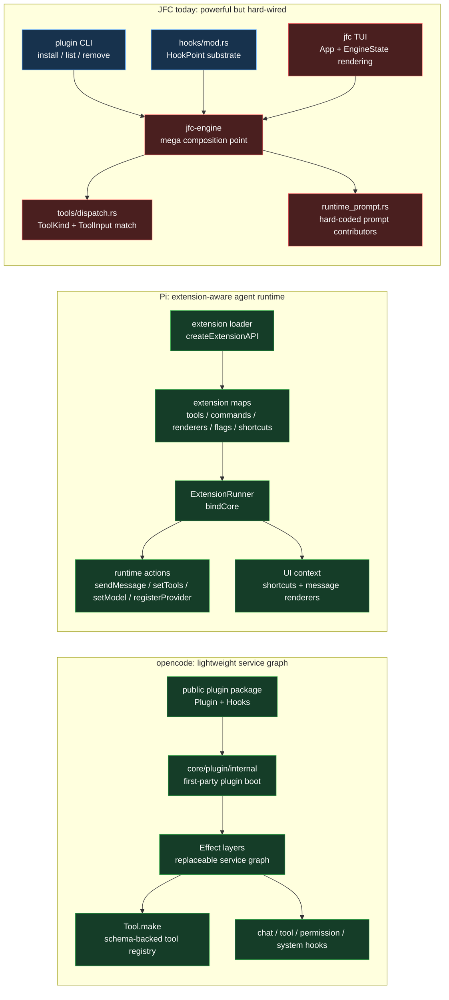
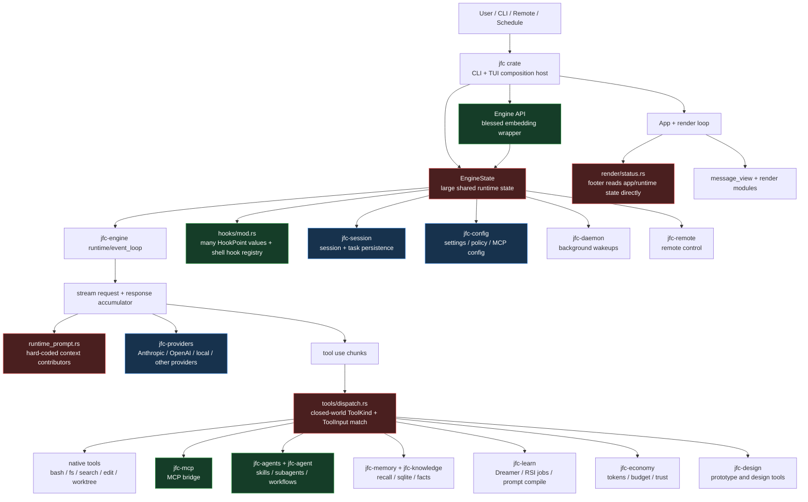
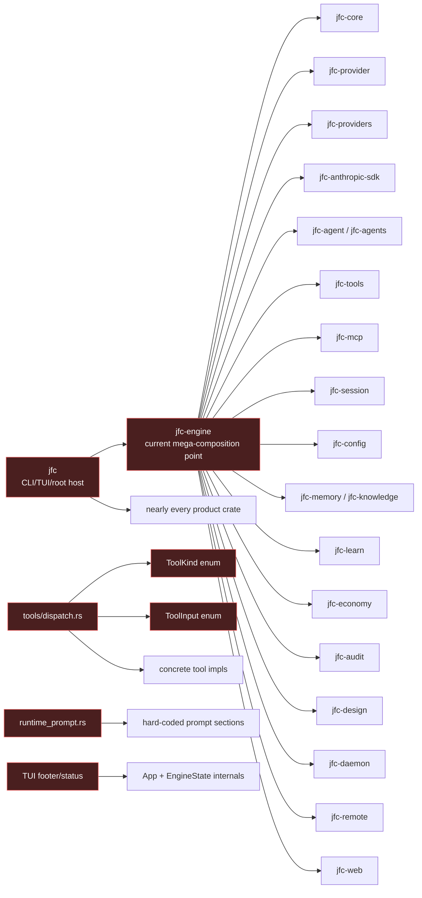
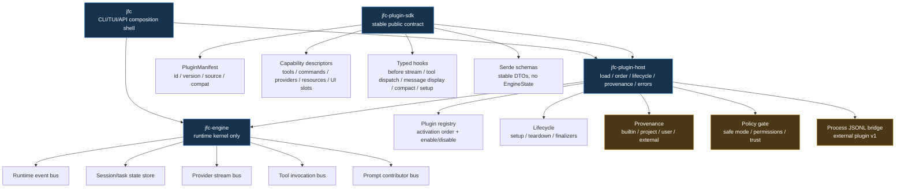
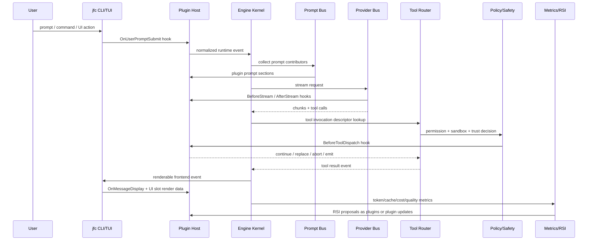
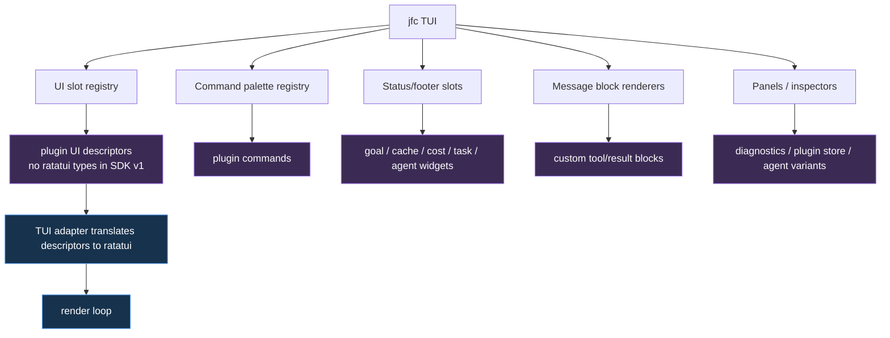
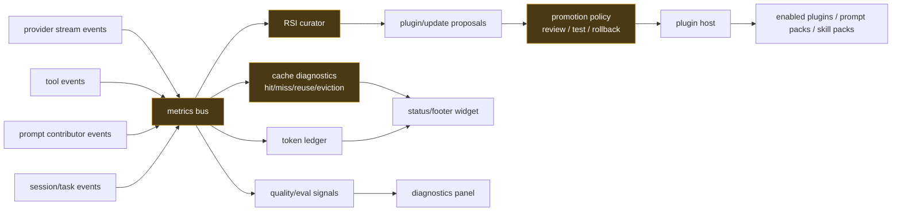
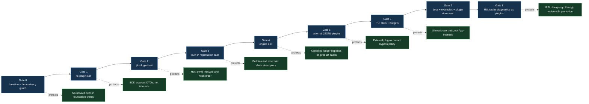

# JFC Architecture Map

This is the root Mermaid map for JFC's infrastructure. It is intentionally progressive: start with the current factory floor, compare it against opencode and Pi, then follow the belts toward the plugin-first architecture where built-ins and external mods use the same contract.

Source anchors used for this map:

- `Cargo.toml` workspace metadata.
- `crates/jfc-engine/src/engine.rs`: embedding API and the current `EngineState` boundary.
- `crates/jfc-engine/src/hooks/mod.rs`: hook point and hook registry substrate.
- `crates/jfc-engine/src/tools/dispatch.rs`: current closed-world tool dispatch.
- `crates/jfc-core/src/tool_input.rs` and `crates/jfc-core/src/tool_kind.rs`: current tool schema/kind enums.
- `crates/jfc-engine/src/stream/request/runtime_prompt.rs`: hard-coded runtime prompt contributors.
- `crates/jfc/src/cli/plugin.rs`: existing plugin CLI surface.
- `.omo/plans/jfc-all-plugin-refactor.md`: target all-plugin refactor plan.
- `/home/cole/WebstormProjects/forks/opencode/packages/plugin/src/index.ts`: opencode public plugin hooks.
- `/home/cole/WebstormProjects/forks/opencode/packages/plugin/src/v2/effect/plugin.ts`: opencode V2 plugin shape.
- `/home/cole/WebstormProjects/forks/opencode/packages/core/src/plugin/internal.ts`: opencode first-party plugin boot path.
- `/home/cole/WebstormProjects/forks/opencode/packages/core/src/tool/tool.ts`: opencode schema-backed tool registry.
- `/home/cole/WebstormProjects/forks/opencode/packages/core/src/effect/layer-node.ts`: opencode typed service graph composition.
- `/home/cole/WebstormProjects/forks/pi/packages/coding-agent/src/core/extensions/loader.ts`: Pi extension API and loader.
- `/home/cole/WebstormProjects/forks/pi/packages/coding-agent/src/core/extensions/runner.ts`: Pi extension runner bound into the live session.
- `/home/cole/WebstormProjects/forks/pi/packages/coding-agent/src/core/extensions/types.ts`: Pi loaded extension shape.
- `/home/cole/WebstormProjects/forks/pi/packages/coding-agent/src/core/agent-session.ts`: Pi agent session owns an extension runner.

## Reference Architecture Comparison

opencode and Pi both feel lightweight because they put the extension seam before product behavior hardens into app internals.

opencode's main move is a small public plugin contract plus a typed service graph. Its public `Hooks` surface can add tools/providers/auth, mutate chat params and headers, intercept permission asks, run before/after tools, alter shell env, transform system/messages, and mutate tool definitions. Its V2 plugin shape is even smaller: `{ id, effect(context) }`. First-party capabilities are booted through `core/plugin/internal.ts`, so built-ins and configured plugins are conceptually on the same rail. Tools are schema-backed definitions registered into a service, not variants in one central app enum.

Pi's main move is a live extension runtime. `createExtensionAPI` lets extensions register tools, slash commands, shortcuts, flags, custom message renderers, and providers. It also exposes curated runtime actions: send messages, append entries, set session name/labels, get and set active tools, refresh tools, set model/thinking level, execute commands, register/unregister providers, and use the event bus. `ExtensionRunner` starts with safe stubs, then `bindCore()` attaches those actions to the live session/UI/provider registry once the runtime exists. That is why Pi feels more "mod the whole agent" than opencode.

JFC has more raw machinery than both in several areas: hooks, MCP, plugin install/list/remove CLI, skills, agents, providers, task/session stores, Dreamer/RSI jobs, goals, economy/cost/trust, design tools, voice, and a richer TUI. The gap is not capability. The gap is seam placement: JFC usually wires the feature first inside `jfc-engine` or `jfc`, then exposes a partial hook later. opencode and Pi expose a stable extension seam first, then hang features from it.

## Design Differences

| Area | opencode | Pi | JFC today | What JFC should change |
| --- | --- | --- | --- | --- |
| Architecture center | Effect service graph and plugin hooks | Agent session plus extension runner | `jfc-engine` as broad composition point | Make `jfc-engine` a kernel with buses, move product behavior to plugin packs |
| Plugin API | Public `Plugin`/`Hooks` package | `ExtensionAPI` factory API | Plugin CLI plus shell/config hooks | Add `jfc-plugin-sdk` with descriptors and runtime action DTOs |
| Runtime host | Plugin boot path registers first-party and external behavior | `loadExtensions` + `ExtensionRunner` | No central runtime plugin host | Add `jfc-plugin-host` for discovery, lifecycle, ordering, provenance, status |
| Tools | Schema-backed `Tool.make` registry | Extensions can `registerTool` | Closed `ToolKind` and `ToolInput` enums with dispatch match | Add tool descriptors and handler registry before adding more tools |
| Providers | Provider/auth hooks | Extensions can dynamically `registerProvider` | Provider trait exists, concrete providers are engine dependencies | Add provider descriptors and dynamic provider registration |
| Prompt/context | Chat params/system/message transform hooks | Extension handlers and session runtime actions | `runtime_prompt.rs` hard-codes contributors | Add prompt contributor bus |
| UI modding | Mostly core/plugin hooks; less UI-deep | Strong: shortcuts, UI context, message renderers | TUI reads `App`/`EngineState` directly | Add UI slots: footer, panels, message renderers, command palette |
| Safety | Permission service stays central; plugins can hook decisions | Runtime actions are curated and stale contexts are invalidated | Safe mode exists, but hooks/tools/plugin CLI are separate surfaces | Host-level safe-mode/provenance/permission gate for every plugin capability |
| Built-ins | First-party plugins boot through plugin internals | Built-ins and extensions share runner-era registries | Built-ins wired directly in engine/TUI | Convert built-ins into first-party plugin packs |

## Translation For JFC

Copy opencode's contract discipline:

- public SDK crate separate from engine internals
- built-ins registered through the same contract as user plugins
- schema-backed tool definitions
- service graph / layer replacement mindset
- permission and policy kept central

Copy Pi's runtime affordances:

- extension runner with loaded extension maps
- runtime actions exposed as a curated API
- command, shortcut, flag, and message-renderer registration
- dynamic provider registration
- extension UI context without raw TUI ownership
- stale-context invalidation after reload/session replacement

Do not copy the loose parts:

- do not expose raw `EngineState`
- do not make Rust dynamic libraries the v1 ABI
- do not let plugins mutate arbitrary app state
- do not make UI plugins depend on ratatui widget internals
- do not keep adding enum variants for external tools

## Factory Legend

| Factory idea | Architecture meaning |
| --- | --- |
| Power plant | Kernel runtime: sessions, event loop, policy, safety, state transitions |
| Main bus | Stable SDK and plugin host contracts |
| Machines | Built-in capability packs: tools, providers, agents, memory, learn, design, voice |
| Belts | Typed events, descriptors, hook calls, tool requests, provider streams |
| Splitters | Registries and routing tables |
| Smart splitters | Policy checks, safe mode, permissions, trust/provenance |
| Blueprints | Plugin manifests, schemas, examples, compatibility docs |
| Awesome sink | Metrics, cache diagnostics, RSI evaluation, cost/token accounting |

## Floor 0: Current Checkout

Today, `jfc` and `jfc-engine` are doing most of the integration work directly. The useful pieces already exist, but the dependency graph is still product-crate-first instead of plugin-first.

### Current Bottlenecks

The important diagnosis: the hook system, plugin CLI, MCP bridge, skills, workflows, Dreamer jobs, and provider abstractions are real substrate. The missing piece is the public, stable contract that lets those pieces register from outside the source tree.

## Floor 1: Plugin Spine

The first factory upgrade is not widgets. It is a stable spine that every capability can plug into.

Rules for this floor:

- `jfc-plugin-sdk` must not depend on `jfc-engine`, `jfc`, ratatui, concrete providers, concrete tools, design, voice, daemon, or config loader internals.
- `jfc-plugin-host` owns discovery, activation order, lifecycle, hook execution, and plugin status.
- `jfc-engine` stops being the place where every product capability is wired by hand.
- The SDK exposes descriptors and DTOs, not `EngineState`, `EngineEvent`, or the current dispatch internals.

## Floor 2: Built-Ins Become Plugin Packs

Once the spine exists, built-ins should use the same path as external mods. This is the point where JFC becomes PI-like: the default app is just a distribution of first-party plugins.

```mermaid
flowchart TB
    host["jfc-plugin-host"] --> builtin_index["Builtin plugin index"]
    host --> external_index["External plugin index\nproject/user/global roots"]

    builtin_index --> provider_pack["provider pack\njfc-providers + jfc-anthropic-sdk + jfc-auth"]
    builtin_index --> tool_pack["tool pack\njfc-tools + native tool impls"]
    builtin_index --> agent_pack["agent pack\njfc-agent + jfc-agents + workflows"]
    builtin_index --> mcp_pack["MCP pack\njfc-mcp bridge"]
    builtin_index --> memory_pack["knowledge pack\njfc-memory + jfc-knowledge + jfc-web"]
    builtin_index --> learn_pack["RSI pack\njfc-learn + prompt compile + skill induction"]
    builtin_index --> governance_pack["governance pack\njfc-economy + jfc-audit + slop guard"]
    builtin_index --> ux_pack["UX pack\njfc-design + jfc-voice"]
    builtin_index --> background_pack["background pack\njfc-daemon + jfc-remote"]

    external_index --> ext_tools["external tools"]
    external_index --> ext_agents["agent variants"]
    external_index --> ext_store["plugin store"]
    external_index --> ext_widgets["widgets / components"]
    external_index --> ext_providers["providers"]

    provider_pack --> provider_desc["ProviderDescriptor"]
    tool_pack --> tool_desc["ToolDescriptor"]
    agent_pack --> agent_desc["AgentDescriptor"]
    mcp_pack --> resource_desc["ResourceDescriptor"]
    memory_pack --> resource_desc
    learn_pack --> hook_desc["HookDescriptor"]
    governance_pack --> policy_desc["PolicyDescriptor"]
    ux_pack --> ui_desc["UiSlotDescriptor"]
    background_pack --> command_desc["CommandDescriptor"]

    provider_desc --> kernel_bus["kernel buses"]
    tool_desc --> kernel_bus
    agent_desc --> kernel_bus
    resource_desc --> kernel_bus
    hook_desc --> kernel_bus
    policy_desc --> kernel_bus
    ui_desc --> tui_slots["TUI slot registry"]
    command_desc --> command_router["command router"]

    classDef firstparty fill:#153d28,stroke:#2ea043,color:#fff;
    classDef thirdparty fill:#3b2b54,stroke:#a371f7,color:#fff;
    classDef bus fill:#17324d,stroke:#58a6ff,color:#fff;
    class provider_pack,tool_pack,agent_pack,mcp_pack,memory_pack,learn_pack,governance_pack,ux_pack,background_pack firstparty;
    class ext_tools,ext_agents,ext_store,ext_widgets,ext_providers thirdparty;
    class kernel_bus,tui_slots,command_router bus;
```

## Floor 3: Turn Lifecycle Through Extension Belts

This is the target request/response path. Plugins can add or mutate behavior at typed points without reaching into app internals.

## Floor 4: UI Modding Surface

UI mutation should come after the host and descriptor system. If UI slots come first, they will accidentally expose internal state and freeze the wrong API.

Good first UI slots:

- Status/footer: active goal, elapsed goal runtime, token/cache usage, cost, agent count, plugin health.
- Command palette: plugin commands and plugin store actions.
- Message blocks: custom renderers for tool results and diagnostics.
- Panels: cache diagnostics, RSI metrics, plugin store, agent variant manager.

## Floor 5: Cache Diagnostics And RSI Feedback

The cache/RSI system should be a first-party plugin pack, not scattered across prompt construction, Dreamer jobs, provider calls, and footer rendering.

## Progressive Build Gates

## Workspace Disposition Map

| Crate | Current role | Target floor |
| --- | --- | --- |
| `jfc-core` | Shared core types, tool kinds, tool inputs | Kernel foundation, stable IDs/types |
| `jfc-provider` | Provider trait/vocabulary | Bridge-neutral provider contract |
| `jfc-engine` | Runtime plus many product integrations | Runtime kernel, event bus, policy boundary |
| `jfc` | CLI/TUI plus all-crates composition | Thin host shell and TUI adapter |
| `jfc-plugin-sdk` | Not present in current workspace | Stable plugin contract |
| `jfc-plugin-host` | Not present in current workspace | Loader, lifecycle, provenance, hook executor |
| `jfc-tools` | Shared native tool helpers | Built-in tool plugin pack |
| `jfc-mcp` | MCP registry/tool bridge | Built-in MCP/resource plugin pack |
| `jfc-agent` | Agent primitive crate | Agent primitive or agent SDK support |
| `jfc-agents` | Agent/skill loading and registries | Built-in agents/skills/workflows plugin pack |
| `jfc-providers` | Concrete provider implementations | Built-in provider plugin pack |
| `jfc-anthropic-sdk` | Anthropic API client and skill upload surface | Provider support crate used by provider pack |
| `jfc-auth` | Auth helpers | Auth/provider support plugin or bootstrap service |
| `jfc-config` | Configuration loading and policy | Bootstrap/persistence service plus plugin config reader |
| `jfc-session` | Session and task persistence | Bootstrap/persistence service |
| `jfc-changeset` | Change-set tracking | Safety/persistence capability plugin or bootstrap support |
| `jfc-memory` | Persistent memory store | Knowledge plugin pack |
| `jfc-knowledge` | Knowledge database/facts | Knowledge foundation/service |
| `jfc-web` | Web support | Knowledge/data plugin pack |
| `jfc-learn` | Dreamer, learning, prompt compile | RSI/learning plugin pack |
| `jfc-compress` | Compression support | Knowledge/context plugin pack |
| `jfc-economy` | Cost, budget, trust | Governance/metrics plugin pack |
| `jfc-audit` | Audit and safety analysis | Governance/security plugin pack |
| `jfc-daemon` | Background daemon | Background runtime adapter plugin |
| `jfc-remote` | Remote-control support | Remote/API adapter plugin |
| `jfc-design` | Design/prototype tools | UX/product plugin pack |
| `jfc-voice` | Voice support | UX/product plugin pack |
| `jfc-markdown` | Markdown rendering/parsing | Frontend/render support |
| `jfc-theme` | Terminal theme support | Frontend/TUI support |
| `jfc-bridge` | Integration bridge utilities | Auth/provider bridge capability plugin |

## Non-Negotiable Architecture Rules

- Do not expose `EngineState` as the plugin SDK.
- Do not expose current `ToolInput` or `ToolKind` as the only way to add external tools.
- Do not make native Rust dynamic libraries the first external plugin ABI.
- Do not let external plugin tools bypass safe mode, permission policy, MCP policy, or sandbox decisions.
- Do not make UI mutation depend on direct access to `App`, render internals, or ratatui widget types.
- Do not start the modularity work by rewriting every provider. Start with descriptors and host boundaries, then move built-ins one pack at a time.

## First Practical Slice

The highest-leverage first slice is:

1. Add an enforceable workspace dependency-direction test.
2. Add `jfc-plugin-sdk` with manifest, descriptor, hook, bridge, source, compat, and error modules.
3. Add `jfc-plugin-host` with in-process plugin registration, deterministic hook order, lifecycle finalizers, provenance, safe-mode behavior, and status snapshots.
4. Adapt the existing shell hook registry and plugin CLI to delegate into the host without changing user-visible behavior.
5. Convert native tool definitions into descriptors before moving the actual implementations.

That slice gives the project a real main bus. After that, tools, agents, providers, UI slots, plugin store, and RSI/cache diagnostics can be added as machines on the belt instead of new hard-coded branches inside `jfc-engine`.
